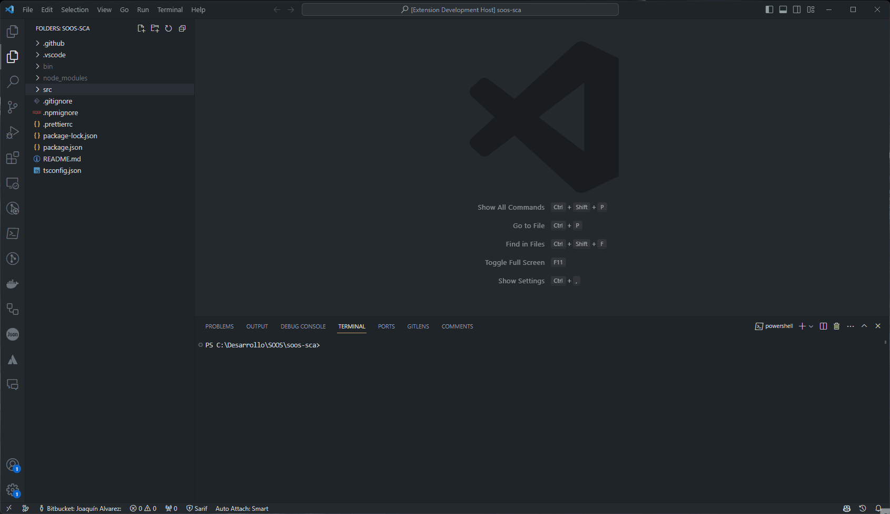
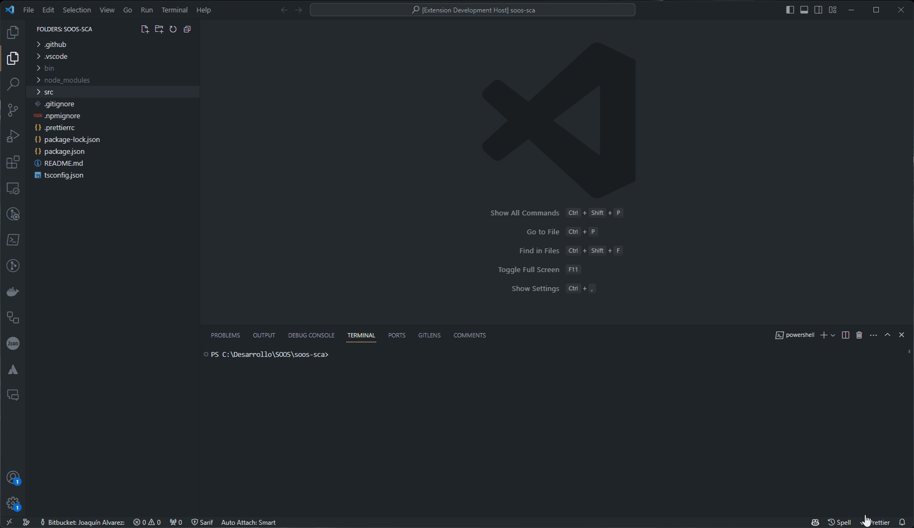
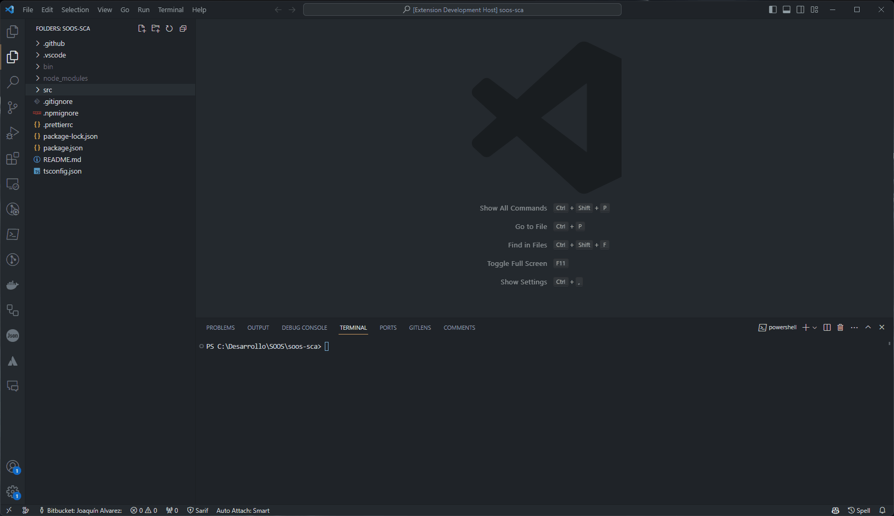

# SOOS SCA Visual Studio Extension

SOOS is an independent software security company, located in Winooski, VT USA, building security software for your team. [SOOS, Software security, simplified](https://soos.io).

Use SOOS to scan your software for [vulnerabilities](https://app.soos.io/research/vulnerabilities) and [open source license](https://app.soos.io/research/licenses) issues with [SOOS Core SCA](https://soos.io/products/sca). [Generate and ingest SBOMs](https://soos.io/products/sbom-manager). [Export reports](https://kb.soos.io/help/soos-reports-for-export) to industry standards. Govern your open source dependencies. Run the [SOOS DAST vulnerability scanner](https://soos.io/products/dast) against your web apps or APIs. [Scan your Docker containers](https://soos.io/products/containers) for vulnerabilities. Check your source code for issues with [SAST Analysis](https://soos.io/products/sast).

[Demo SOOS](https://app.soos.io/demo) or [Register for a Free Trial](https://app.soos.io/register).

If you maintain an Open Source project, sign up for the Free as in Beer [SOOS Community Edition](https://soos.io/products/community-edition).

# Requirements

- Having a valid account on SOOS. [Register for a Free Trial](https://app.soos.io/register)

# How to use it

1. Configure the secrets using the `Configure SOOS SCA Secrets` command, it will ask you for your client and api key, that can be found on the [integrate page](https://app.soos.io/integrate/sca/)

2. Configure Project Name and additional settings running the `Configure SOOS SCA Scan` command.

3. Once settings are set up we can run it, in here we have two options, one will be to manually run the `Run SOOS SCA Scan` from the command palette or select the folder directly from the sidebar and click con `Run SOOS SCA Scan` from there.

# Reference

- [Publish your extension](https://code.visualstudio.com/api/working-with-extensions/publishing-extension) on the VS Code extension marketplace.
- [Extension Manifest](https://vscode-docs.readthedocs.io/en/latest/extensionAPI/extension-manifest/)
